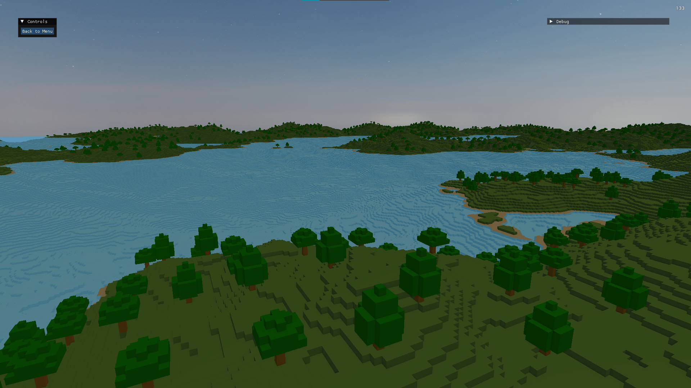

# Practice Engine

A simple practice engine built with C++ 23 and OpenGL 4.6 Core. Primarily focused on voxels at the moment.

## Features
- 'Infinite' Terrain with Chunking
	- Multi-Threaded Generation
	- Multi-Threaded Mesh Building
- Rendering
	- Basic Lighting (Blinn-Phong Model)
	- First-Person Camera
	- Skybox
- GUI with ImGui

## Dependencies
- [GLFW](https://www.glfw.org/) - Windowing and input
- [GLM](https://glm.g-truc.net/) - OpenGL Math
- [GLAD](https://glad.dav1d.de/) - OpenGL loader
- [ImGui](https://github.com/ocornut/imgui) - GUI Library
- [STB Image](https://github.com/nothings/stb) - Image loading

Ensure these are cloned or installed in the `external/` directory, following the configuration in CMakeLists.txt.

## Resources
Ensure you have skybox textures in the `resources/textures/skybox` directory (top, bottom, left, right, front, back).

## Building the Project
Tested on Windows 10 with the basic Visual Studio 2026 setup.

## Helpful Links
- [LearnOpenGL](https://learnopengl.com/) - OpenGL tutorials.
- [OpenGL-Tutorial](https://www.opengl-tutorial.org/) - More OpenGL tutorials.

## To-Do 
- Voxel World
	- Cleaner Multi-Threading
	- Further Mesh and Chunk Optimizations
	- Binary Greedy Meshing
	- LOD System
	- Chunk Culling
	- Better World Generation
	- DDA Raycasting (for world interactions)
- Rendering
	- Basic Shadows
	- Better Lighting
	- Anti-Aliasing
	- Ambient Occlusion
	- Non-Static Skybox
	- Clouds
	- Water
- General
	- Profiler (tracy?)
	- Better Comments
	- Documentation