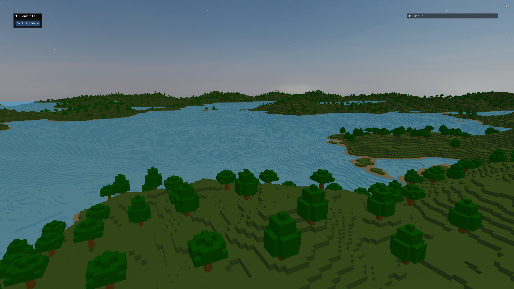

# Practice Engine

A practice voxel engine built with modern C++ and OpenGL.

## Features
- 'Infinite' Terrain with Chunking
	- Multi-Threaded Chunk Generation
	- Multi-Threaded Mesh Building
- Rendering
	- Hybrid Pipeline
		- Deferred (Opaque)
		- Forward (Translucent)
	- Lighting
		- Blinn-Phong Model
		- Directional, Point, and Spot
	- Screen Space Ambient Occlusion
	- Frustrum Culling
	- Skybox
	- Water

## Dependencies
- [GLFW](https://www.glfw.org/) - Windowing and input
- [GLM](https://glm.g-truc.net/) - OpenGL Math
- [GLAD](https://glad.dav1d.de/) - OpenGL loader
- [ImGui](https://github.com/ocornut/imgui) - GUI Library
- [STB Image](https://github.com/nothings/stb) - Image loading
- [Tracy](https://github.com/wolfpld/tracy) - Profiling

Ensure these are present in the `external/` directory, following the configuration in CMakeLists.

## Resources
Skybox textures go in the `resources/textures/skybox` directory (top, bottom, left, right, front, back).

Models (vox) go in the `resources/models` directory.

## Building the Project
Tested on Windows 10 with the basic Visual Studio 2026 setup.

## To-Do 
- Voxel World
	- Generation Optimizations
	- Binary Greedy Meshing
	- LOD System
	- DDA Raycasting
- Rendering
	- Directional Light Shadows
	- Better Water
	- Anti-Aliasing
	- Dynamic Skybox
	- Clouds
- General
	- Organization
	- Documentation